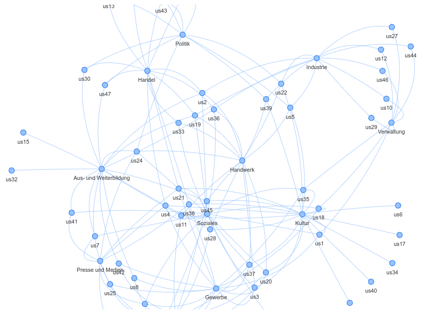

# Link zum Blog

[Blog 1 vom 19.04.2021](./Blog1.md)

## Willkommen auf der Website der <!modellstadt!>  

- [ ] Logos einbauen

Hier entsteht die Präsenz einer Initiative der <!modellstadt!> zur Digitalisierung.
In den Leitlinien dazu wurde ein partizipativer Ansatz beschrieben und ausgewählt. Um dieser Leitlinie zu folgen wird das "doing" auf einem open source Ansatz aufsetzten. Damit haben alle Beteiligten die Möglichkeit sich aktive einzubringen in dem sie z.B. Dokumente oder Projektvorschläge kommentieren oder Verbsserungsvorschläge einbringen.      

Es wird dabei dem allgemein bekannten open source Verfahren gefolgt (Contributer/Maintainer Modell).    

### Motivation
In der <!modellstadt!> gibt es viele Aktivitäten die sich dem Thema Digitaliserung, Nachhaltigkeit und Teilhabe widmen. Dieses im geschäflichen als auch im Verwaltungsbereich als auch im ehrenamtlichen Bereich. Bisher gab es aber keine gemeinsame Plattform welche diese einzelnen Aktivitäten verbindet, unterstützt und weitere Aktivitäten startet.   
Parallel haben der Unternehmerverband der <!modelstadt!> und die Verwaltung der <!modelstadt!> Aktivitäten zu starten um eine solche Plattform voranzutreiben. Mittlerweile sind diese beiden Aktivitäten zusammengeführt und werden zusammen vorangetrieben.
tbc

### was bisher geschah
Input required

### Aktueller Stand
Input required

### Stakeholder
+ Verwaltung der <!modelstadt!>
+ Rat der <!modelstadt!>
+ Verband der Unternehmer der <!modelstadt!>
+ Hochschule der <!modelstadt!>
+ Universität der <!modelstadt!>
+ Schulen der <!modelstadt!>
+ ...
+ ...

### bisher gesammelter "input" (user stories)

### Lizenz
CC (creative common) 
- [ ] korrekte Version noch zu bestimmen

### Support or Contact
Fragen, Anregungen? Bitte nutzen sie die Projekt-Seite um sich zu beteiligen 🙂
